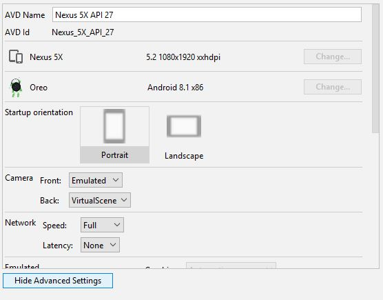

# ABNProject1Final
After making some changes to my sumitted work based on the feed back I got from the reviewer, I refactored my project to meet the requirements. 

# Heathwood Hardware

[Github link](https://github.com/roylouislgarcia/HeathWoodHardware)
Above is the link to a repository of a project that I submitted as Project 1 of the deliverables required by the Udacity and Google's Android Basics Nanodegree. 

### Prerequisites

1. I had been following the lectures to make an interactive android app as part of Udacity's Grow With Google Anroid Basics Nanodegree [Udacity](https://www.udacity.com/course/android-basics-nanodegree-by-google--nd803)
2. Download this repository and use Android Studio IDE to create the project locally.

## Changes made to the original submission

1. I reverted to an older version of the Android Emulator to test my projects from hereforth:

Name: Nexus_5X_API_27
CPU/ABI: Google Play Intel Atom (x86)
Target: google_apis_playstore [Google Play] (API level 27)
SD Card: 100M
hw.lcd.height: 1920
hw.lcd.width: 1080
image.androidVersion.api: 27

2. I create dimens.xml to avoid hardcoding values that I may want to update from a convenient resource file, just like values I put in string.xml, colors.xml, etc ...

### Screenshot of the resubmitted project

## Author

Roy Louis L. Garcia
